**AZ 900 Study Guide**

1. [CLOUD CONCEPTS](#cloud-concepts)
   1. [Cloud computing](#cloud-computing)
   2. [Core Cloud Services](#core-cloud-services)
   3. [Elasticity](#elasticity)
   4. [Scalability](#scalability)
   5. [High Availability](#high-availability-ha-eamples)
   6. [Cloud Economics](#cloud-economics)
   7. [Cloud Deployment Models](#cloud-deployment-models)
2. [Azure Core Services](#azure-core-services)
   1. [Compute](#azure-core-services-compute)
      1. [Azure VMs](#azure-vms)
      2. [VM Availability](#vm-availability)
      3. [App Services](#app-services)
      4. [Containers](#containers)
      5. [Serverless Computing](#serverless-computing)
      6. [Compare Compute Options](#comparing-compute-options)
   2. [Network](#azure-core-services-networking)
      1. [Azure VNet](#azure-virtual-network)
      2. [Hybrid Connectivity](#hybrid-connectivity-options)
      3. [Load Balancers](#azure-load-balancers)
      4. [CDN](#cdn)
   3. [Data](#azure-core-services-data-and-storage-services)
      1. [Types of Data](#types-of-data)
      2. [Azure SQL](#azure-sql)
      3. [Cosmos DB](#cosmos-db)
      4. [Azure Storage](#azure-storage)
      5. [VM Disk Storage](#vm-disk-storage)
      6. [Storage Account](#storage-account-overview)
   4. [Other Services](#azure-core-services-other-services)
      1. [IoT Services](#iot-services-azure-iot)
      2. [Big Data](#big-data-solutions)
      3. [Machine Learning](#machine-learning)
3. [Identity](#identity)
   1. [Accounts and Subscriptions](#accounts-and-subs-overview)
   2. [Domain Services](#domain-services)
   3. [Azure AD](#azure-ad)
   4. [RBAC](#rbac)
   5. [Azure Policy](#azure-policy)
   6. [Azure Resource Locks](#resource-locks)
4. [Compliance, Security, and Cost](#compliance-security-and-cost)
   1. [Compliance and Security](#compliance-and-security)
   2. [Security Center](#security-center)
   3. [Support Plans](#support-plans)

Online Resources 
[Microsoft SelfPaced](https://docs.microsoft.com/en-us/learn/paths/azure-fundamentals/)

Test banks
- [ITExams link](https://www.itexams.com/exam/AZ-900)
- [ExamTopics link](https://www.examtopics.com/exams/microsoft/az-900/)
- [CertQueen link](https://freedumps.certqueen.com/new-cracked-microsoft-azure-fundamentals-az-900-exam-dumps/)

# CLOUD CONCEPTS

## Cloud computing

- rent vs. purchase
- pay as you go
- shared responsibility model

## Core Cloud Services

- Compute
- Network
- Storage
- Application Services
- Analytics

## Elasticity
Major pattern benefitting from cloud computing
Resources change according to the workload changes 
Either static or elastic scaling (e.g. seasonal demand for a retail web site)

## Scalability
- Increase/Decrease resources based on workload demand
- Vertical scaling
  - Also known as scaling up
  - Add additional resources to increase the power of the workload (e.g. more CPU to a VM)
- Horizontal scaling
  - Also known as scaling out
  - Adding many smaller resources to cater to a workload

## Defitnion of SLA
Service Level Agreement (SLA) is an agreement with business and application teams
on the expected performance and availability of a specific service

SLAs for Azure products and services have 3 characteristics
- Performance targets (specific to each Azure product/service)
- Uptime and connectivity guarantees
- Service credits (e.g. Microsoft might credit customers back for underperforming Azure products/services)

### General SLA practices:
- Define SLA for each workload
- Depdendency mapping (include internal and external dependencies)
- Identify single points of failure (e.g. app needs 99.99% but is depdending on a service with 99.9%)

### Key terms:
| Term | Definition |
| ----------- | ----------- |
| Mean Time To Recovery (MTTR) | Average time to recover from an outage |
| Mean Time Between Failures (MTBF) | Average time between outages |
| Recovery Point Objective (RPO) | Interval of time in which data could be lost during a recovery (e.g. 5min RPO means up to 5 minutes of data are lost.) |
| Recovery Time Objective (RTO) | Time requirement for recovery to be completed in before there is a business impact. |

### Calculating downtime

> E.g. we have a web app that is connected to a DB.
> Below are the SLA for each component
> web app with 99.95% SLA
> SQL DB with 99.99% SLA

Composite SLA is 
> 99.95 percent × 99.99 percent = 99.94 percent

This means the combined probability of failure is higher than the individual SLA values. This isn't surprising, because an application that relies on multiple services has more potential failure points.

The above scenario can be enhanced with the below design 
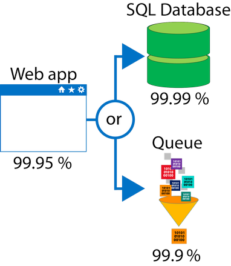

With this design, the application is still available even if it can't connect to the database. However, it fails if both the database and the queue fail simultaneously.

If the expected percentage of time for a simultaneous failure is 0.0001 × 0.001, the composite SLA for this combined path of a database or queue would be: 
> 1.0 − (0.0001 × 0.001) = 99.99999 percent

Therefore, if we add the queue to our web app, the total composite SLA is:

> 99.95 percent × 99.99999 percent = ~99.95 percent

Notice we've improved our SLA behavior. However, there are trade-offs to using this approach: the application logic is more complicated, you are paying more to add the queue support, and there may be data-consistency issues you'll have to deal with due to retry behavio

## Fault Tolerance:
- Redundency is built into services so that if one component fails, another takes its place.
- Reduce impact when disaster occurs.

## Disaster Recovery:
- Planning for catastrophic failure of workloads
- Region to region failover
- OnPrem to cloud failover
- Automation & Orchestration.

## High Availability (HA) eamples:
*Host outage*
- When an underlying host has a catastrophic failure, the VM will automatically restarted on another host.
- Availability sets and zones further incrase the availability.

*Cross Region Deployment*
- An application is deployed in a configuration to be highly available across regions
- When a service in one region has an outage, traffic can continue to run in the second region.

## Cloud Service Models
Revolves around what is managed:
1. Application
2. Data
3. Runtime
4. Middleware
5. O/S
6. Virtualization
7. Servers
8. Storage
9. Networking

### Pizza As A Service Example

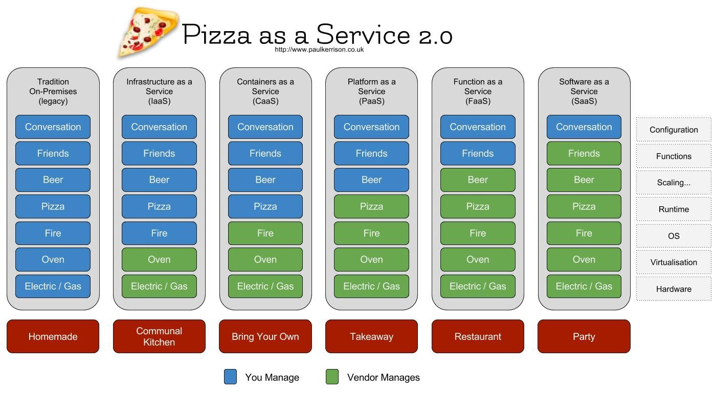

- Traditional (we manage everything)
- Infrastructure As A Service (IaaS) (we manage 1-5, vendor manages 6-9). 
Typically used for "lift and shift" scenarios where we move VMs from onPrem to cloud.
- Platform As A Service (PaaS) (manage 1 and 2, rest is on the vendor).
Either used as a development framework (e.g. Azure App services, Pivotal Cloud Foundry, IoT, Biz Analytics)
- Software As A Service (SaaS) (all is managed by the vendor)
(e.g. Office365, Salesforce, etc)

### IT Cloud Services
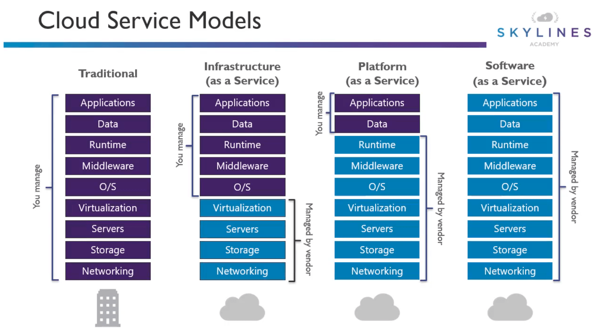

## Cloud Economics

### Economies of scale
> Ability to do things efficiently or at lower cost due to operating at a large scale.

### Benefits
- Able to acquire hardware at lower costs
- Local Gov deals
- These savings are passed on to the consumer
- Datacenter efficiencies
  
### CAPEX vs. OPEX

| CAPEX | OPEX |
| ----------- | ----------- |
| Spending on infrastructure is completed upfront | No upfront cost |
| Cost written off over a period of time | Pay as you go |
|  | Deduct from tax bill in same year as expense occurs |

#### Typical *onPrem* OPEX costs
- Server costs
- Storage costs
- Network costs
- Backup and Archive costs
- Datacenter Costs (includes Disaster Recovery)

#### Typical *Cloud* OPEX costs
- Server lease costs
- Software and future leases
- Usage/Demand cost scaling

#### CAPEX vs OPEX Benefits
| CAPEX | OPEX |
| ----------- | ----------- |
| Predictability | Try and buy |
| Cost effective when you consume the infrastructure quickly | Low initial costs |
|  | Demand fluctuation |

## Cloud Deployment Models

### Public Cloud
- Common deployment model
- Azure/AWS/GCP examples
- Everything runs on the provider's hardware

| Advantages | Disadvantages |
| ----------- | ----------- |
| High scalability/agility | some security requirements cannot be met by the public cloud |
| Pay as you go pricing, pay for usage, no OPEX | Gov/Industry/Legal policies that cannot be met by the public cloud |
| Not responsible for maintenance or hardware updates | You don't own the infrastructure |
| *Minimal* tech knowledge needed to get *started* | Unique business requirements |

### Private Cloud
- Create a cloud-like environment onPrem
- Responsible for hardware and software services
- Characterised by:
  - Self service
  - Automation
  - Agility
  - Financial Transparency

| Advantages | Disadvantages |
| ----------- | ----------- |
| Complete control over all resources | Large upfront costs |
| Complete security control | High skillset required |
| May be able to meet strict compliance requirements that cannot be met by the public cloud | Owning the equipment adds a lag into provisioning process |
| | Datacenter management |

### Hybrid Cloud
- Combines public and private clouds
- Allows flexibility to run in the most appropriate location
- Consume public cloud services as needed, and potentially keep legacy workloads running onPrem

| Advantages | Disadvantages |
| ----------- | ----------- |
| Flexibility | Complicated to maintain and setup (need to factor in specific cloud knowledge vs. onPrem and also when going with multiple cloud providers) |
| Support for legacy apps while enabling modern apps to move  | Can be more expensive than simply selecting one model |
| Take advantage of economies of scale from public cloud providers when it's cheaper  and augment with your own equipment when it's not cheaper |  |
| Continue to use your own equipment and investments |  |

# AZURE CORE SERVICES

## Azure Cloud Services Overview

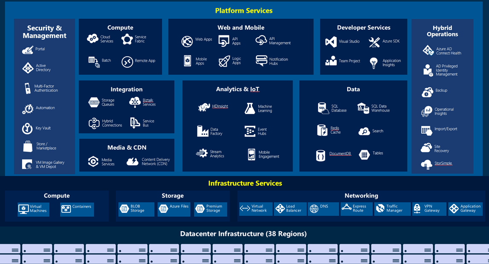

## Azure Portal Overview Demo

- Can create and share Dashboards (basically JSON files, can embed queries into them as well)
- Cloudshell allows gives the user a CLI option right in the browser. Can switch between Bash or Powershell, with a storage account to store all user scripts data to be consistent.
- Subscription is the billing group this resource will be part of
- Resource group is a logical grouping of resources
- There is a download template option available after creating a VM

## Resource Group Demo

- there is an activity log that logs everything done with a resource group
- IAM/RBAC controls can be added directly to a resource group
- Resource groups can be tagged (stuff like MaintenanceWindow, CostCentre, etc)
- there are events that be added to a resource group, more related to logic apps and the like.
- costs can be seen under a given group's resource costs option
- Deployment can display all deployments done (either via portal or ARM templates) - pay attention to this
- resource groups can have policies added to them (force encryption, restrict VM types within a resource group) - pay attention to this
- there is an option to download the deployment scripts via the Automation Scripts option.
- once a resource group is deleted, all resources contained within are also deleted.

### Organizing principles

You can use a resource group to group by:
- By type (e.g. all VNets, all VMs, all DBs, etc)
- By environment (e.g. prod, qa, dev)
- By department (finance, it, hr)

You can use resource groups depdending on:
- Who needs to access them (e.g. DBAs, sysadmins, AppDevs)
- What lifecycle do the resources inside need
- For billing purposes

# AZURE CORE SERVICES: COMPUTE

## Azure VMs
### What is a VM:

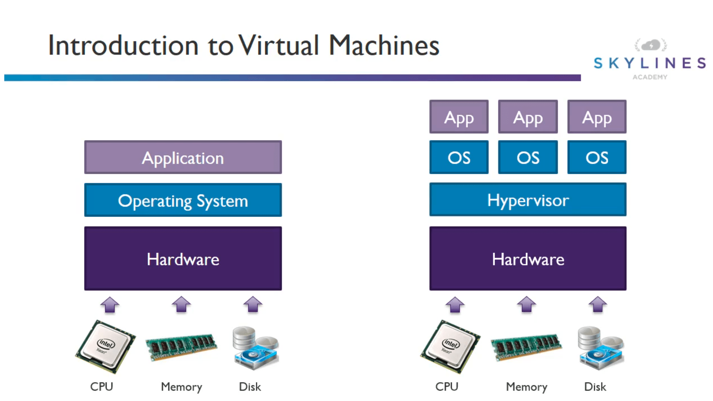

### VM Types:

| Type | Purpose |
| ----------- | ----------- |
| A - Basic | Basic version of the A series for testing and development |
| A - Standard | General purpose VMs |
| B - Burstable | Burstable instances that can burst to the full capacity of the CPU when needed. Mostly for things like webservers, as when they are not in use, they would accumulate CPU credits that will be consumed when utilised |
| D - General Purpose | Built for enterprise applications.  DS instances offer premium storage. |
| E - Memory Optimized | High memory to CPU core ratio.  ES instances offer premium storage. |
| F - CPU Optimized | High CPU core to memory ratio.  FS instances offer premium storage. |
| G - Godzilla | Very large instances ideal for large databases and big data use cases. |
| H - High performance compute | High performance compute instances aimed at very high-end computational needs such as molecular modelling and other scientific applications. |
| L - Storage optimized | Storage optimized instances which offer a higher disk throughput and IO. |
| M - Large memory | Another large scale memory option that allows for up to 3.5 TB of RAM. |
| N - GPU enabled | GPU enabled instances. |
| SAP HANA on Azure certified instances| Specialized instances purposely built and certified for running SAP HANA |

### VM Specializations
- S -> Premium storage option available (e.g. DSv2)
- M -> Large memory configuration of the instance (e.g. Standard A2m_v2)
- R -> Supports remote direct memory access (RDMA) (e.g. H16mr)

### Connecting to a Windows VM
- Using RDP
- Using Powershell (Get-AzureRmRemoteDesktopFile)
- WinRM (Http**s** on port 5986/Http on port 5985)

#### WINRM Self-signed process
- Create key vault
- Create self-signed certificate
- Upload cert to key vault
- Get URL for cert from key vault
- Reference the cert when creating the VM

[More info here](https://docs.microsoft.com/en-us/azure/virtual-machines/windows/winrm)

## VM Availability

### Availability Sets

**Potential for VM impact**
- Planned maintenance
- Unplanned hardware maintenance
- Unexpected Downtime

**Availablity Sets**
> - Group two or more machines in a set
> - Separated based on fault and update domains

### Fault and Update Domains

Read more about FDs and UDs [here](https://blogs.msdn.microsoft.com/plankytronixx/2015/05/01/azure-exam-prep-fault-domains-and-update-domains/)

#### Fault Domain (FD):
- A rack that has its own power and networking connectivity
- A single availability set can have up to 3 FDs
- So our VMs can be spread across those 3 FDs, so if one FD has an outage the other VMs will remain unaffected.

#### Update Domain (UD):
- These help Microsoft update their **underlying hosts** sequentially.
- Microsoft wont update the same UDs at the same time.
- Up to 20 UDs can be allowed
- Order cannot be controlled

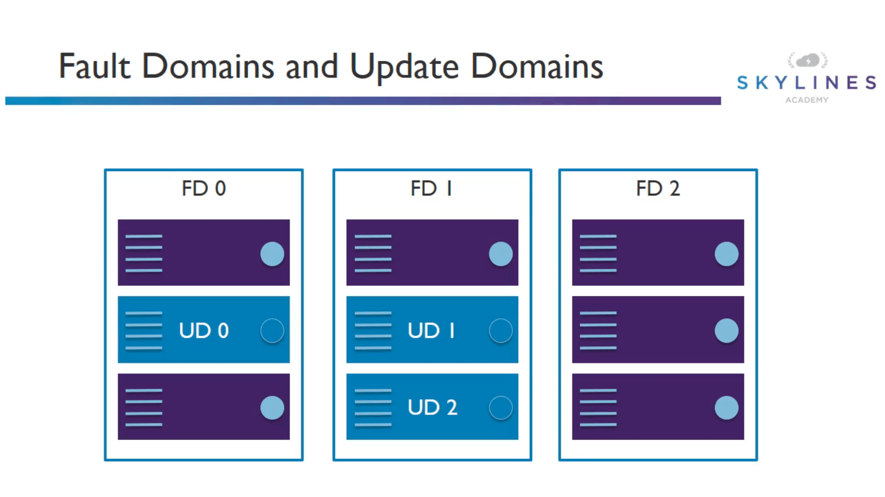

### Planning for availability
- Seperate the VMs across sets

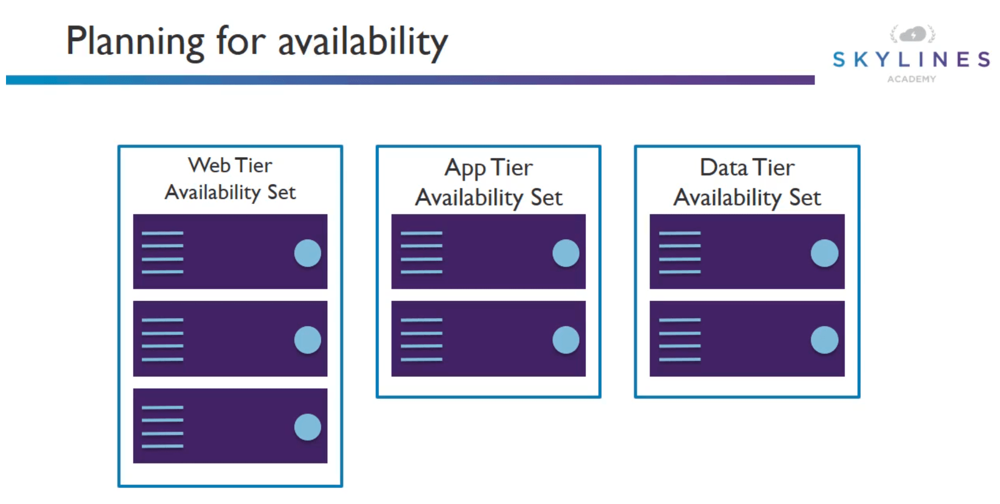

## Availability Zones

- An Availability Zone in an Azure region is a combination of a fault domain and an update domain
- Offers 99.99% availability
- Minimize impact of planned and unplanned downtime
- Enforce them like availability sets but you get to choose your azure zone
- It is either zones or sets, can't have both. You will be moved to zones - double check this

Azure services that support Availability Zones fall into two categories:

- Zonal services – you pin the resource to a specific zone (for example, virtual machines, managed disks, Standard IP addresses), or
- Zone-redundant services – platform replicates automatically across zones (for example, zone-redundant storage, SQL Database).

### Region Pairs

Each Azure region is always paired with another region within the same geography (such as US, Europe, or Asia) at least 300 miles away. This approach allows for the replication of resources (such as virtual machine storage) across a geography that helps reduce the likelihood of interruptions due to events such as natural disasters, civil unrest, power outages, or physical network outages affecting both regions at once. If a region in a pair was affected by a natural disaster, for instance, services would automatically fail over to other region in its region pair.

Advantages inlcude 

- If there's an extensive Azure outage, one region out of every pair is prioritized to make sure at least one is restored as quick as possible for applications hosted in that region pair.
- Planned Azure updates are rolled out to paired regions one region at a time to minimize downtime and risk of application outage.
- Data continues to reside within the same geography as its pair (except for Brazil South) for tax and law enforcement jurisdiction purposes.

### Virtual Machine Scale Set
Azure Virtual Machine Scale Sets let you create and manage a group of identical, load balanced VMs. Imagine you're running a website that enables scientists to upload astronomy images that need to be processed. If you duplicated the VM, you'd normally need to configure an additional service to route requests between multiple instances of the website. Virtual Machine Scale Sets could do that work for you.

Scale sets allow you to centrally manage, configure, and update a large number of VMs in minutes to provide highly available applications. The number of VM instances can automatically increase or decrease in response to demand or a defined schedule. With Virtual Machine Scale Sets, you can build large-scale services for areas such as compute, big data, and container workloads.

### Azure Batch

Azure Batch enables large-scale job scheduling and compute management with the ability to scale to tens, hundreds, or thousands of VMs.

When you're ready to run a job, Batch does the following:

- Starts a pool of compute VMs for you
- Installs applications and staging data
- Runs jobs with as many tasks as you have
- Identifies failures
-  Requeues work
-  Scales down the pool as work completes

## App Services
Consist of the following:
- Web apps
  - formarly known as "websites"
  - build and host using various programming languages
  - auto-scalable
  - highly available
  - DevOps features
- Mobile apps
  - build a mobile app backend
  - highly scalable and available
  - build native (iOS/Android/Windows/cross-core) apps
  - Benefit: shares the same app service deployment to reduce run rates
- Logic apps
  - automate business process and workflows
  - use orchestration engine to build a solution
  - Examples:
    - Every time your app calls an API, do something
    - Routinely ingest data from a storage blob or external SaaS-based service
    - Regularly check tweets or #Slack messages from a specific account
- API apps
  - Create consume or call APIs
  - Can also call external API services or your own

### Security features
- Features run on isolated VM
- ISO, SOC, and PCI compliant
- Fully integrated Azure Active Directory
- Managed service identity
- Supports custom domains, SSL/TLS, as well as custom certificates using wildcard or subject alternate name
- Support for multiple authentication protocols (OAuth/OpenID/AD)
- Integration with WAF

### DevOps features
- CI/CD support with Git/Github/Bitbucket/MS VSTS
- IDE tool integration
- Deployment from external folders like Dropbox and OneDrive
- Deployment slots: stage environments (Dev/Prod/etc)

### App service plans overview
Define the following first:
- Which subscription the plan belongs to?
- Location
- Pricing tier
- Instance size

Then Configure the following:
- Scale count (e.g. 1,2,3 instances)
- Scale rules (allow for autoscaling where applicable)
- Scale up (increase the resources associated with the app plan, this is how you switch the plan you first created)

[More info here](https://docs.microsoft.com/en-us/azure/app-service/overview-hosting-plans)

### App service pricing tiers

Runs on shared compute resources
- free
- shared

Runs on dedicated azure VMs
- basic
- premium
- isolated (also known as app service environment)

[MUST READ ABOUT SERVICE LIMITS](https://docs.microsoft.com/en-us/azure/azure-subscription-service-limits)

### App service plans general guidelines
- Create for specific apps
- Deploy app services to support the application
- DO NOT use a single plan for every web app (difficult to scale and manage)
- Combine app services vs mass VM creation
- Combine other services in the same resource group

### App Service Environments (ASEs)
- Fully isolated environments
- Can host mobile apps/web apps/API apps/azure functions
- For high performance apps - high CPU and/or memory
- Individual or multiple services plan
- Can be deployed
  - Internal ASE: Internal Virtual IP is created on an internal Azure Load Balancer (AKA ILB ASE).
  - External ASE: Accessible via the Internet. After selecting the VNet, you select the IP address you want to use.
- Created in a subnet of a VNet to achieve isolation.
- May take hours to provision due to the dedicated nature of the resource.

## Containers

### What are containers?
- Standardized packages for software and their depdencies
- A way to isolate apps from each other
- Works on Linux and Windows
- Allows separate apps to share the same OS kernel

Containers provide a consistent, isolated execution environment for applications. They're similar to VMs except they don't require a guest operating system. Instead, the application and all its dependencies is packaged into a "container" and then a standard runtime environment is used to execute the app. This allows the container to start up in just a few seconds, because there's no OS to boot and initialize. You only need the app to launch.

#### Reasons behind popularity
- Monolithic app issues
  - Minor code changes required full recompile and testing
  - Application becomes a single point of failure
  - Application becomes difficult and often expensive to scale

#### Solution to the above is the following
- Microservices: break an application to separate services
- 12 Factor apps: make the app independently scalable, stateless, highly available by design

### Monolithic vs. Microservices
| Monolithic | Microservices |
| ----------- | ----------- |
| Simple deployments | Partial deploymens |
| Inter-module refactoring | Strong module boundaries |
| Vertical scaling | Horizontal scaling |
| Technology mono-culture | Technology diversity |

### Keys to microservices
- Functional decomposition (decompose the app into separate services)
- Horizontal scale (scale what you need, not what you don't and what scaling options)
- Data decoupling (pick the best DB for each service)

## Serverless computing

- Abstraction of server infrastructure and operating system
- Fully managed services
- Only pay for what you use
- Flexibility to scale as needed
- Stitch together applications and services seemlessly

### Azure serverless computing services
- Azure functions
  - Support for C#,F#,Javascript, Java
  - Pay per use pricing
    - Consumption plan
    - App service plan (run on the same plan as other services)
  - Integrated security using OAuth providers
  - Code in the portal or deploy via DevOps tools
- Logic apps
  - Workflow engine
  - Orchestrate and stitch together functions and services
  - Visualize, design, build, automate
  - Key concept of trigger -> action
- Event grid

### Comparing compute options

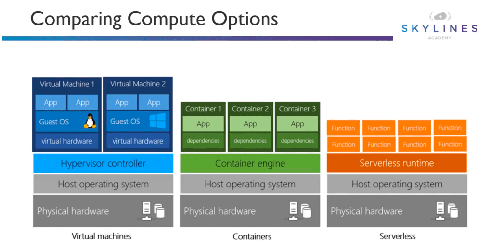

# AZURE CORE SERVICES: NETWORKING

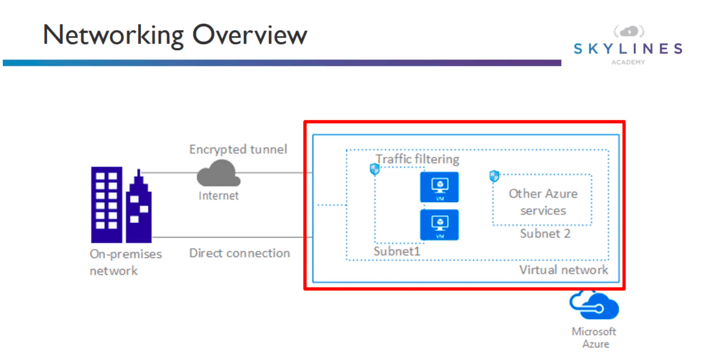

[Read more about VNets](https://docs.microsoft.com/en-us/azure/virtual-network/virtual-networks-overview)

## Azure Virtual Network

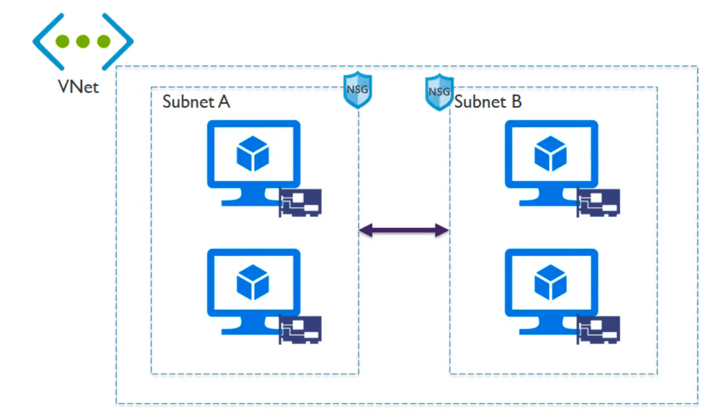

**Capabilities**
- Isolation
- Internet access
- Can contain multiple Azure resources (VMs and other cloud services)
- VNet connectivity
- OnPrem connectivity
- Traffic filtering
- Routing

**Key Points**
- Primary building block for Azure networking
- Private network in azure based on address space prefix
- Create subnets in your VNet with your IP ranges
- Bring your own DNS or use Azure-provided DNS
- Choose to connect the network to onPrem or the Internet

*Note: look at the demo again and study the script/automation of deploying a VNet*

## Hybrid connectivity options

### Site-to-Site (S2S)
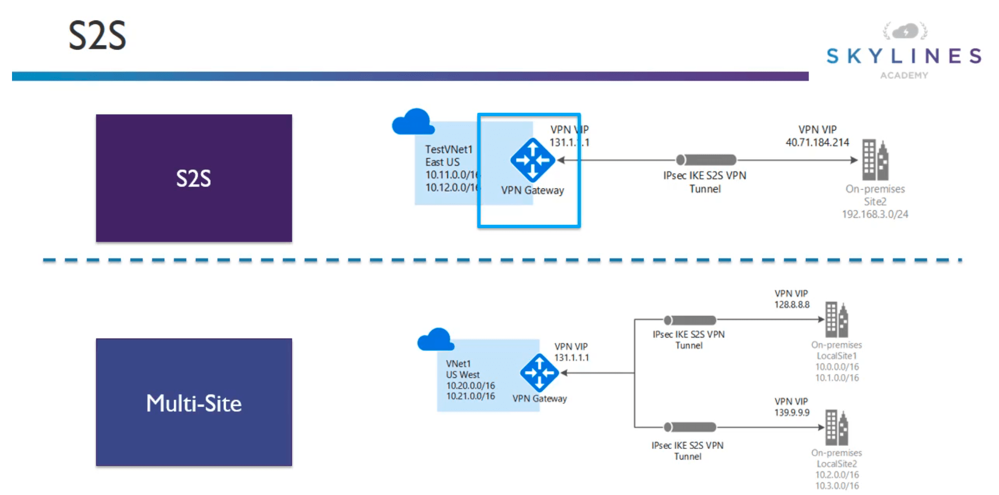
- S2S VPN gateway connection is a connection over IPSec/IKE (IKEv1 or v2) VPN tunnel
- Requires a VPN device in an enterprise datacenter that has a public IP address assigned to it
- Must **not** be located behind a NAT
- S2S connections can be used for cross-premises and hybrid configuratoins  

### Point-to-Site (P2P)
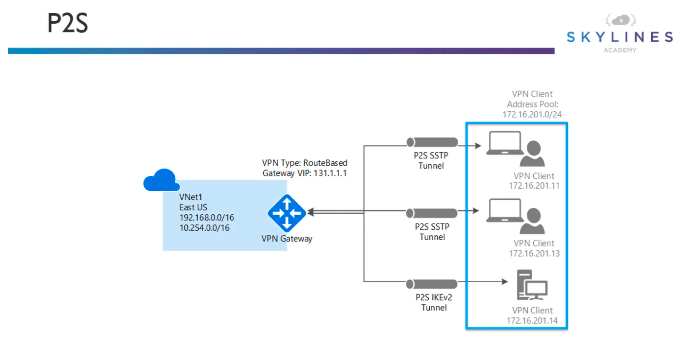
- Secure connection from an individual computer. Greate for remote workers.
- No need for VPN device or public IP. Connect whereever user has Internet connection
- Supports OSes: Win 7,8,8.1 (32/64bit),10. Win Server 2008 R2,2012,2012 R2 64 bit
- Throughput up to 100Mbps (depending on Internet)
- Doesn't scale easily, so only useful for few workstations

#### VPN Gateway SKUs
| SKU | S2S/VNet-to-VNet tunnels | P2S connections | Aggregate throughput benchmark
| ----------- | ----------- | ----------- | ----------- |
| VpnGw1 | Max. 30 | Max. 128 | 650Mbps |
| VpnGw2 | Max. 30 | Max. 128 | 1Gbps |
| VpnGw3 | Max. 30 | Max. 128 | 1.25Gbps |
| Basic | Max. 10 | Max. 128 | 100Mbps |

#### VPN Gateway Recommendations
|Workload | SKUs |
| ----------- | ----------- |
| Production, critical workload | VpnGw1,VpnGw2,VpnGw3 |
| Dev-test or proof of concept| Basic |

|SKU | Features |
| ----------- | ----------- |
| Basic | **Route-based VPN**: 10 tunnels with P2S; no RADIUS auth for P2S; no IKEv2 for P2S **Policy-based VPN**: (IKEv1): 1 tunnel no P2S |
| VpnGw1,VpnGw2,VpnGw3 | **Route-based VPN**: up to 30 tunnels(*),P2S, BGP,active-active, custom IPSec/IKE policy ExpressRoute/VPN co-exsitence |

[More about VPN gateways here](https://docs.microsoft.com/en-us/azure/vpn-gateway/vpn-gateway-about-vpngateways)

### ExpressRoute

[More about ExpressRoute here](https://docs.microsoft.com/en-us/azure/expressroute/expressroute-introduction)

[More about ExpressRoute connectivity models](https://docs.microsoft.com/en-us/azure/expressroute/expressroute-connectivity-models)

### What is an ExpressRoute Circuit?

An ExpressRoute circuit represents a logical connection between your on-premises infrastructure and Microsoft cloud services through a connectivity provider. You can order multiple ExpressRoute circuits. Each circuit can be in the same or different regions, and can be connected to your premises through different connectivity providers.

ExpressRoute circuits do not map to any physical entities. A circuit is uniquely identified by a standard GUID called as a **service key (s-key)**. The service key is the only piece of information exchanged between Microsoft, the connectivity provider, and you. The s-key is not a secret for security purposes. There is a 1:1 mapping between an ExpressRoute circuit and the s-key.

New ExpressRoute circuits can include two independent peerings: Private peering and Microsoft peering. Whereas existing ExpressRoute circuits may contain three peerings: Azure Public, Azure Private and Microsoft. 
Each peering is a pair of independent BGP sessions, each of them configured redundantly for high availability. 
There is a 1:N (1 <= N <= 3) mapping between an ExpressRoute circuit and routing domains. An ExpressRoute circuit can have any one, two, or all three peerings enabled per ExpressRoute circuit.

Each circuit has a fixed bandwidth (50 Mbps, 100 Mbps, 200 Mbps, 500 Mbps, 1 Gbps, 10 Gbps) and is mapped to a connectivity provider and a peering location. The bandwidth you select is shared across all circuit peerings

#### Benefits of ExpressRoute
- Layer 3 connectivity: between your onPrem and Microsoft through a connectivity provider. Can be from any-to-any (IPVPN) network, point-to-point Ethernet connection,  or through a virtual cross-connection via an Ethernet exchange.
- Connectivity in all regions in a given geopolitical region towards Microsoft cloud.
- Global connectivity towards Microsoft cloud with the premium add-on
- Dynamic routing between your network and Microsoft over industry standard protocols (BGP)
- Built-in redunduncy in every peering location for higher reliability.

#### Provisioning ExpressRoute

[More about ExpressRoute workflow](https://docs.microsoft.com/en-us/azure/expressroute/expressroute-workflows)

Make sure you have the following pieces of information

#### Unlimited vs. Metered
|Unlimited | Metered |
| ----------- | ----------- |
| Speeds from 50Mbps to 10Gbps | Speeds from 50Mbps to 10Gbps |
| Unlimited **inbound** data transfer | Unlimited **inbound** data transfer |
| Unlimited **outbound** data transfer| Outbound data transfer charged at rate/Gb |
| Higher monthly fee | Lower monthly fee |

### ExpressRoute limits
Q. Are there limits on the number of routes I can advertise?
 A. Yes. We accept up to 4000 route prefixes for private peering and 200 for Microsoft peering. You can increase this to 10,000 routes for private peering if you enable the ExpressRoute premium feature.

Q. Are there restrictions on IP ranges I can advertise over the BGP session?
 A. We do not accept private prefixes (RFC1918) for the Microsoft peering BGP session. We accept any prefix size (up to /32) on both the Microsoft and the private peering.

#### Express considerations
- Understand the models
  - Differences between unlimited and metered data
  - Understand what model to use to accelerate adoption
  - Understand differences in available port speeds, locations and approach
  - Understand the limits that drive additional circuits

- Understand the providers
  - Each offer a different experience based on ecosystem and capabilities
  - Some provide complete solutions and management
- Understand the costs
  - Connection costs can be broken out by the service connection costs (Azure) and the authorized carrier costs(telco partner).
  - Unlike other azure services, look beyond the pricing calculator.

## Azure Load Balancers

More about Azure Load Balancer [here](https://docs.microsoft.com/en-us/azure/load-balancer/load-balancer-overview)

### Load balancer 

Most common, works at the transport layer/layer 4. Provides network level distribution to resources located in the same datacenter.

- Layer 4 
- Basic and Standard SKUs <-- Microsoft recommends Standard
- Service monitoring (allows to probe the health of VM behind it)
- Automatic reconfiguration (i.e. when adding new webserver instances)
- Hash based distribution. This is how it distributes its traffic. Has a 5 tuple hash of the following
  - Source IP
  - Source Port
  - Destination IP
  - Destination Port
  - Protocol Type
  Also has session stickiness
- Internal (e.g. infront of 2 DB instances), Public (e.g. infront of webservers) and multi-tier (mix of internal and public) options. As well as cross-premises virtual network.
- Pricing is based on
  - Number of load-balancing and outbound rules
  - Amount of data processed inbound and outbound independent of rules

### Application gateway

More about AppGateway [here](https://docs.microsoft.com/en-us/azure/application-gateway/overview)

Works at layer 7/app layer. Also acts as a reverse proxy

- Layer 7 load balancer (make routing decisions based on attributes of a HTTP request like URI path or host headers)
- Cookie based session affinity
- SSL offload
- End2End SSL (terminate SSL at the app gateway, apply routing rules to the traffic, then re-encrypting it again)
- WAF
- URL based content routing
- Autoscaling
- Requires its own subnet before you deploy it
  
**App gateway sizes (approximate)**

|Page response | Small | Medium | Large |
| ----------- |----------- | ----------- |----------- |
| 6K | 7.5Mbps | 13Mbps | 50Mbps |
| 100K | 35Mbps | 100Mbps | 200Mbps |
  
### Traffic manager (global scale, globally available end points. works at the DNS level)

Read more about Traffic manager [here](https://docs.microsoft.com/en-us/azure/traffic-manager/traffic-manager-overview)

### Comparison
|Service | Azure load balancer | App gateway | Traffic manager |
| ----------- | ----------- | ----------- | ----------- |
| Technology | Transport layer (layer 4) | Application layer (layer 7) | DNS-level |
| Application Protocols Supported| Any | HTTP(s) and websockets | Any (HTTP endpoint is needed for endpoint monitoring)|
| Endpoints | Azure VMs, cloud service role instances | Any Azure internal IP address, public IP address Azure VM, or Azure cloud service | Azure VMs, cloud services, Azure web apps, external endpoints |
| VNet | Can be used for both Internet  and internal (VNet) apps | Can be used for both Internet  and internal (VNet) apps | Only supports Internet facing apps |
| Endpoint monitoring | via probes | via probes | via HTTP(s) GET |

## CDN
A content delivery network (CDN) is a distributed network of servers that can efficiently deliver web content to users. CDNs store cached content on edge servers in point-of-presence (POP) locations that are close to end users, to minimize latency.

[More about Azure CDN](https://docs.microsoft.com/en-us/azure/cdn/cdn-overview)

### Offerings
- Standard Akamai
- Standard Verizon
- Premium Verizon

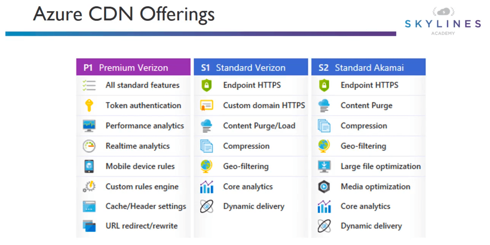

### Features
- Dynamic site acceleration
- CDN caching rules
- HTTPS custom domain support
- Azure diagnostic logs
- File compression
- Geo-filtering
- Video streaming optimization
- Large file optimization
- URL redirect/rewrite
- Mobile device rules

[MUST READ CDN FEATURES](https://docs.microsoft.com/en-us/azure/cdn/cdn-features)

### Benefits
- Better performance and improved user experience for end users, especially when using applications in which multiple round-trips are required to load content.
- Large scaling to better handle instantaneous high loads, such as the start of a product launch event.
- Distribution of user requests and serving of content directly from edge servers so that less traffic is sent to the origin server.

### How does it work?

- A user (Alice) requests a file (also called an asset) by using a URL with a special domain name, such as <endpointname>.azureedge.net. This name can be an endpoint hostname or a custom domain. The DNS routes the request to the best performing POP location, which is usually the POP that is geographically closest to the user.

- If no edge servers in the POP have the file in their cache, the POP requests the file from the origin server. The origin server can be an Azure Web App, Azure Cloud Service, Azure Storage account, or any publicly accessible web server.

- The origin server returns the file to an edge server in the POP.

- An edge server in the POP caches the file and returns the file to the original requestor (Alice). The file remains cached on the edge server in the POP until the time-to-live (TTL) specified by its HTTP headers expires. If the origin server didn't specify a TTL, the default TTL is seven days.

- Additional users can then request the same file by using the same URL that Alice used, and can also be directed to the same POP.

- If the TTL for the file hasn't expired, the POP edge server returns the file directly from the cache. This process results in a faster, more responsive user experience.

### Limitations

- The number of CDN profiles that can be created.
- The number of endpoints that can be created in a CDN profile.
- The number of custom domains that can be mapped to an endpoint.

# AZURE CORE SERVICES: DATA AND STORAGE SERVICES

## Types of Data

### Structured Data

- Adheres to a schema
- All the data has the same field or properties
- Stored in a database table with rows and columns
- Relies on keys to indicate how one row in a table relates to another row in another table
- Referred to as relational data

### Semi Structured Data

- Doesn't fit into tables/rows/columns
- Uses tags/keys to organize and provide a heirarchy
- Referred to as NoSQL or non-relational data

### Unstructure Data

- No designated structure
- No restrictions on what type of data it can hold
- Example, blob can hold PDF/JPEG/JSON/Videos/etc
- Enterprises struggling to manage and gain insight from this data

## Azure SQL

Details [here](https://docs.microsoft.com/en-us/azure/sql-database/sql-database-technical-overview)

- Relational DB as a service
- Latest stable version of MSSQL
- Either create new or migrate using Microsoft Data Migration Assistant

### Features

- Predictable performance: Measure in Database Throughput Units (DTU)
- High compatibility: Supports existing SQL clients via tubular database stream (TDS) endpoint
- Simplified Management: Icludes SQL server specific Azure tools

**DTU Definition**: 
A database transaction unit (DTU) represents a blended measure of CPU, memory, reads, and writes. The DTU-based purchasing model offers a set of preconfigured bundles of compute resources and included storage to drive different levels of application performance. If you prefer the simplicity of a preconfigured bundle and fixed payments each month, the DTU-based model might be more suitable for your needs.  
More [here](https://docs.microsoft.com/en-us/azure/sql-database/sql-database-purchase-models#dtu-based-purchasing-model)
### Deployment models

- **Single database** represents a fully managed, isolated database. You might use this option if you have modern cloud applications and microservices that need a single reliable data source. A single database is similar to a contained database in Microsoft SQL Server Database Engine.
- **Managed instance** is a fully managed instance of the Microsoft SQL Server Database Engine. It contains a set of databases that can be used together. Use this option for easy migration of on-premises SQL Server databases to the Azure cloud, and for applications that need to use the database features that SQL Server Database Engine provides.
- **Elastic pool** is a collection of single databases with a shared set of resources, such as CPU or memory. Single databases can be moved into and out of an elastic pool.

### Database tiers

|Basic | Standard | Premium |
| ----------- | ----------- | ----------- |
| Small DB with single concurrent user| Medium sized DB that must support multi-concurrent connections | Large DB that must a large number of concurrent connections & operations |
| - Small DBs - Single active operation - Dev/Test - Small scale apps - 5 DTU| - Good for cloud apps - Multiple operations - Workgroup or web apps - 10-100 DTU | - High txn volumes - Large number of users - Multiple operations - Mission critical apps - 100-800 DTU |

### NEW - Managed Azure SQL Instances

- Managed SQL servers
- More compatible with legacy workloads

### Third party DBs - Managed (MySQL/PostgreSQL)

- Managed DB options
  - built-in HA (no additional cost)
  - Predictable performance
  - Pay as you go
  - Auto scaling
  - Encryption (in motion/at rest)
  - Auto backups with point in time restore (upto 35 days)
  - Enterprise grade security and compliance

### Third party DBs - NON Managed (ClearDB/etc)
- Non managed options
  - Win Azure VM hosting MySQL
  - Linux Azure VM hosting MySQL
  - ClearDB offering managed MySQL instance

## Cosmos DB
- Globally distributed database service
- Supports schema-less data
- Used to build highly available responsive always-on apps with constantly changing data

**Example**
Devs frequently updating catalog ---> online course catalog ---> Cosmos DB <--- Global users

[More on Azure Cosmos DB here](https://docs.microsoft.com/en-us/azure/cosmos-db/introduction)

### Azure Cosmos DB topology

[More on Azure Cosmos DB topology](https://docs.microsoft.com/en-us/azure/cosmos-db/distribute-data-globally)

### Azure Cosmos DB features

Can access via following APIs

- Document DB (SQL) API
- MongoDB API
- Graph (Gremplin) API
- Tables (Key/Value) API

Automatically partitioned for
- Performance
- Storage capacity

**MUST READ MORE**

## Azure Storage

### Azure blob storage

- Unstructured storage for storing objects
- Store images/videos/files of any type
- Uses cases:
  - Streaming video and audio.
  - Storing data for backup and restore, disaster recovery, and archiving.
  - Storing data for analysis by an on-premises or Azure-hosted service.
  - Serving images or documents directly to a browser.
  - Storing files for distributed access.-
  - Writing to log files.

#### Blob storage resources

Blob storage offers three types of resources:

- The storage account.
- A container in the storage account
- A blob in a container

If a storage account is named *mystorageaccount*, then it will be

`http://mystorageaccount.blob.core.windows.net`

More info about blob storage [here](https://docs.microsoft.com/en-us/azure/storage/blobs/storage-blobs-introduction)

More info about Azure storage account [here](https://docs.microsoft.com/en-us/azure/storage/common/storage-account-overview?toc=%2fazure%2fstorage%2fblobs%2ftoc.json)

#### Types of Blobs

Azure Storage supports three types of blobs:

- Block blobs store text and binary data, up to about 4.7 TB. Block blobs are made up of blocks of data that can be managed individually.
- Append blobs are made up of blocks like block blobs, but are optimized for append operations. Append blobs are ideal for scenarios such as logging data from virtual machines.
- Page blobs store random access files up to 8 TB in size. Page blobs store virtual hard drive (VHD) files and serve as disks for Azure virtual machines. For more information about page blobs

See more about [block, append, and page blobs](https://docs.microsoft.com/rest/api/storageservices/understanding-block-blobs--append-blobs--and-page-blobs)

### Azure file services (SMB file storage)

- Easy way to create file shares
- Supports SMB 2.1 (unsecured) and 3.0 (secured)
- Mountable on Win/Linux/OS X
- Azure file sync can be utilized to sync onPrem file servers with Azure files

### Azure table storage
- NoSQL key/value store
- Schemaless design
- Structured/Unstructured data
- Access using Odata protocol and LINQ queries WCF data service .net libraries

[Azure Table Storage Overview](https://docs.microsoft.com/en-us/azure/cosmos-db/table-storage-overview)

[Understanding Table Service Data Model](https://docs.microsoft.com/en-us/rest/api/storageservices/Understanding-the-Table-Service-Data-Model)

### Azure Queue Storage

- Provides reliable mechanism for storage and delivery of messages
- Single queue message can be 64Kb and a queue can contain millions of messages, up to the total capcity limit of a storage account

[Azure Queue Storage Overview](https://docs.microsoft.com/en-us/azure/storage/queues/storage-queues-introduction)

## VM Disk Storage

- Standard HDD
  - backed by traditional HDDs
  - most cost effective
  - throughput based on VM
  - IOPS based on VM
- Standard SSD
  - backed by SSD drives
  - recommended for most workloads
  - max through put 500MB/s per disk
  - max IOPS 2000 IOPS per disk
- Premium Storage
  - backed by SSD drives
  - higher performance, lower latency
  - max through put 750MB/s per disk
  - max IOPS 7500 IOPS per disk

### Managed disks - Standard storage sizes
| Type | S4 | S6 | S10 | S20 | S30 | S40 | S50|
| ----------- | ----------- | ----------- | ----------- | ----------- | ----------- |----------- |----------- |
|Disk Size | 32 | 64 | 128 | 512 | 1024 | 2048 | 4095|

Note: IOPS and through put depend on the performance of the VM and are not provisioned.

### Managed disks - Standard SSD storage sizes
| Type | E4 | E6 | E10 | E15 | E20 | E30 | E40| E50|
| ----------- | ----------- | ----------- | ----------- | ----------- | ----------- |----------- |----------- | ----------- |
|Disk Size | 32 | 64 | 128 | 256 | 512 | 1024 | 2048 | 4095|
|MAX IOPS | 120 | 240 | 500 | 500 | 500 | 500 | 500 | 500 |
|MAX throughput | 25 MB/s | 50 MB/s | 60 MB/s | 60 MB/s | 60 MB/s | 60 MB/s | 60 MB/s | 60 MB/s|

### Managed disks - Premium SSD storage sizes
| Type | P4 | P6 | P10 | P15 | P20 | P30 | P40| P50|
| ----------- | ----------- | ----------- | ----------- | ----------- | ----------- |----------- |----------- | ----------- |
|Disk Size | 32 | 64 | 128 | 256 | 512 | 1024 | 2048 | 4095|
|MAX IOPS | 120 | 240 | 500 | 1100 | 2300 | 5000 | 7500 | 7500 |
|MAX throughput | 25 MB/s | 50 MB/s | 100 MB/s | 125 MB/s | 150 MB/s | 200 MB/s | 250 MB/s | 250 MB/s|

### Ultra SSDs storage sizes
| Type | P4 | P6 | P10 | P15 | P20 | P30 | P40| P50|
| ----------- | ----------- | ----------- | ----------- | ----------- | ----------- |----------- |----------- | ----------- |
|Disk Size | 4 | 8 | 16 | 32 | 64 | 128 | 256 | 512|
|MAX IOPS | 1200 | 2400 | 4800 | 9600 | 19200 | 38400 | 7600 | 80000 |
|MAX throughput | 300 MB/s | 600 MB/s | 1200 MB/s | 2000 MB/s | 2000 MB/s | 2000 MB/s | 2000 MB/s | 2000 MB/s|

Note: 1,024 - 65,536 sizes also available increasing in incrememnts of 1 TiB IOPs capped at 160,000 and throughput capped at 2,000 Read more about it as it is GA on August 2019

### VM LIMITS
> Make sure the VM you have can handle the bandwidth of the storage you selected (throughput and IOPS)

### Managed vs. Un-Managed
| UN-managed | Managed |
| ----------- | ----------- |
| DIY option| Simplest option |
| Management overhead 20,000 IOPS/storage account limit| Lower management overhead as Azure manages the storage accounts|
| Supports all replication modes (LRS, ZRS, GRS, RA-GRS)| Only LRS replication mode currently supported |

### Replication Options 

**MUST READ**

| Type | Description |
| ----------- | ----------- |
| Locally replicated storage (LRS)| Replicated 3 times within a storage scale unit. This is a collection of racks of storage nodes hosted in a datacenter in the same region as your storage account |
| Zone replicated storage (ZRS)| Replicated 3 time across 1 or 2 datacenters in addition to storing 3 replicas similar to LRS. Data stored in ZRS is durable even in the event that the primary datacenter is unavailable or unrecoverable|
| Geographically replicated storage (GRS)| Replicates your data to a second region that is 100s miles away from your primary region. Data is durable even in the event of complete region outage.|
| Read-Only geographically replicated storage (RA-GRS)| Same replication as GRS but also provides read only access to the data in the other region. | 

**Comparison** 

| Replication Strategy | LRS | ZRS | GRS | RA-GRS|
| ----------- | ----------- | ----------- | ----------- | ----------- |
| Data is replicated across multiple datacenters? | No | Yes | Yes | Yes |
| Data can be read from a secondary location *and* the primary location? | No | No | No | Yes |
| Number of copies of data maintained on separate nodes | 3 | 3 | 6 | 6 |

## Storage Account Overview

### 3 types
- General Purpose v1 (GPv1) - only allowed for blob storage
- Blob account
- General Purpose v2 (GPv2) - main type used when creating storage accounts in Azure allows us to create everything (page/block/etc)

### Block Blob vs. Page Blob
| Block Blob Strategy | Page Blob |
| ----------- | ----------- |
| Ideal for storing text or binary files| Efficient for read/write ops |
| Single block blob can contain 50,000 blocks up to 100MB each total size of **4.75TB**| Used by Azure VMs|
| Append blobs are optimized for append ops (e.g. logging)| Up to **8TB** in size|

### Storage tiers
- Hot
  - high storage costs
  - lower access costs
- Cold
  - lower storage costs
  - higher access costs
  - Intended for data that will remain cool for 30days or more
- Archive
  - lowest storage costs
  - highest retrieval costs
  - when a blob is in storage it is offline and cannot be read **MUST BE RE-HYDRATED**

Implement lifecycle (same as AWS S3) concepts

### Choosing between blobs, files, disks
| Type | Benefits |
| ----------- | ----------- |
| Blobs | Access application data from anywhere Large amount of objects to store (images/vids/etc) |
| Files | Access across multiple machines Jumpbox scenarios for shared dev purposes|
| Disks | Do not need access outside of VM Lift and shift of machines from onPrem Disk expansion for app installations|

# AZURE CORE SERVICES: OTHER SERVICES

## IoT Services (Azure IoT)
- Collection of Microsoft managed cloud services focused on connecting, monitoring, and controlling IoT assets
- IoT solutions are made up of 1 or more IoT devices and 1 or more back end services running in the cloud

## Examples
- Water sensors for farming
- Pressure sensors on a remote oil pump
- Temp and humidity sensors in HVAC unit

## IoT Services in Azure
- IoT central: SaaS solution to connect and manage your devices
- IoT hub: The service needed to facilitate messaging between your IoT apps and devices
- IoT solution accelerators: Complete ready to deploy solutions that implement common IoT scenarios

Note: be able to describe and understand IoT and where it fits in from a high level for the exam.

## Big Data Solutions

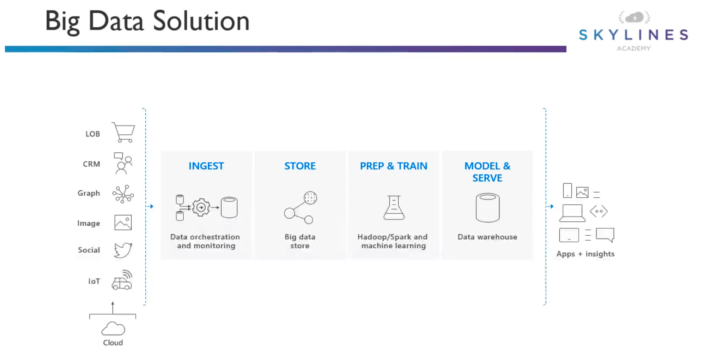

For ingestion: there is Azure data factory

Components
- SQL data warehouse
  - key component of a big data solution
  - cloud based enterprise data warehouse (EDW) that uses massive parallel processing (MPP) to run complex queries across petabytes of data.
  - Stores data in relational tables to reduce storage costs and improve performance
- HDInsight
  - Fully managed open source analytic service for enterprises
  - Uses popular frameworks like Hadoop, Spark, Hive, etc
  - Scenarios
    - Batch processing (ETL)
    - Data warehousing
- Data lake analytics
  - on-demand job service that simplifies big data
  - pay only for the job when it is running
  - write queries to transform data and extract insights

**Which service do I use?**

|If you want... | Use this|
|---------------| --------|
|A fully managed, elastic data warehouse with security at every level of scale at no extra cost | SQL Data Warehouse|
| A fully managed, fast, easy and collaborative Apache® SparkTM based analytics platform optimized for Azure| Azure data bricks|
| A fully managed cloud Hadoop and Spark service backed by 99.9% SLA for your enterprise | HDInsight |
| A data integration service to orchestrate and automate data movement and transformation| Data Factory|
| Open and elastic AI development spanning the cloud and the edge | Machine learning |
| Real-time data stream processing from millions of IoT devices | Azure Stream Analytics |
| A fully managed on-demand pay-per-job analytics service with enterprise-grade security, auditing, and support | Data Lake Analytics |
| Enterprise grade analytics engine as a service | Azure Analysis Services |
| A hyper-scale telemetry ingestion service that collects, transforms, and stores millions of events | Event Hubs |
| Fast and highly scalable data exploration service | Azure Data Explorer|

## Machine Learning

- Machine learning is a data science technique that allows computers to use existing data to forecast future behaviors, outcomes, and trends. By using machine learning, computers learn without being explicitly programmed.
- Azure Machine Learning service provides a cloud-based environment you can use to **prep data, train, test, deploy, manage, and track machine learning models**.
- Automated ML and DevOps capabilities

### Machine learning Studio
- Collaborative, drag-and-drop visual workspace where you can build, test, and deploy machine learning solutions without needing to write code.
- Uses prebuilt and preconfigured machine learning algorithms and data-handling modules as well as a proprietary compute platform

# IDENTITY

- Authentication is the process of establishing the identity of a person or service looking to access a resource. It involves the act of challenging a party for legitimate credentials, and provides the basis for creating a security principal for identity and access control use. It establishes if they are who they say they are.

- Authorization is the process of establishing what level of access an authenticated person or service has. It specifies what data they're allowed to access and what they can do with it.

## Accounts and Subs Overview

### Azure Account Hierarchy

Azure enterprise --> ea.azure.com 
Accounts        --> account.azure.com 
Subscriptions   --> portal.azure.com 

[Read more about it](https://docs.microsoft.com/en-us/azure/cloud-adoption-framework/reference/azure-scaffold)

Access management occurs at the Azure subscription level

### Common patterns

### Enterprise Agreement (EA) Breakdown

| | Enterprise Admin | Department Admin | Account Owner | Service Admin |
|-|-|-|-|-|
Add other admins | Enterprise Admins, Department Admins, and Account Owners| Account Owners | Add Service Admins |No|
Departments | Add/Edit Departments | Edit Department | Not available | Not available |
Add or associate accounts to the enrollment| Yes |Yes – to the department | No | No |
Add Subscriptions | No – but can add themselves as AO| No | Yes | No |
View usage and charges data| Across all Accounts and Subscriptions | Across Department | Across Account | No |
View remaining balances| Yes | No | No | No |

### Billing

## Domain Services

### Azure Active Directory (AAD)
- first choice to use as an authentication method, as it is the way of the future
- modern AD service built for the cloud
- Often the same as O365 directory service
- Can syn with onPrem directory service

### Active Directory Domain Services (ADDS)
- Windows server with active directory domain services installed
- Legacy active directory since win2k
- traditional kerberos and LDAP
- deployed on Windows usually on VMs

### Azure Active Directory Domain Services (AADDS)
- managed version of the active directory domain services mentioned above
- no need to patch and maintain machines (since it is managed by M$)
- allows domain join/group policy/LDAP/kerberos/NTLM

## Azure AD

[Azure AD overview](https://docs.microsoft.com/en-us/azure/active-directory/fundamentals/active-directory-whatis)

### Overview
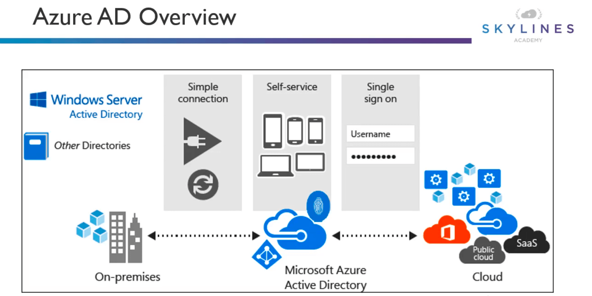

### Features

- Enterprise Identity solution: Create a single identity for users and keep them in sync across the enterprise
- Single sign-on: Provides single sign-on access to applications and infrastructure services.
- Multifactor Authentication (MFA): Enhance security with additional factors of authentication.
- Self service: Empower users to complete password resets themselves, as well as request access to specific apps and services.
- Application management: You can manage your cloud and on-premises apps using Azure AD Application Proxy, SSO, the My apps portal (also referred to as Access panel), and SaaS apps.
- Device Management. Manage how your cloud or on-premises devices access your corporate data.
- Business to business (B2B) identity services. Manage your guest users and external partners while maintaining control over your own corporate data Business-to-Customer (B2C) identity services. Customize and control how users sign up, sign in, and manage their profiles when using your apps with services.

## RBAC
Role 
Based
Access
Control
### Overview
[Read more here](https://docs.microsoft.com/en-us/azure/role-based-access-control/overview)

- Create users,apps,groups
- Assign them to objects in Azure with specific roles

- Owner: full access to all resources, including right to delegate access to others.
- Contributor: can create and manage all types of Azure resources, but cannot grant access to them.
- Reader: can view existing Azure resources, but cannot perform any other action on them.
- Other roles

[READ ABOUT OTHER ROLES HERE](https://docs.microsoft.com/en-us/azure/role-based-access-control/built-in-roles)

- Roles include various actions
- Actions define what type of operations you can perform on a given resource type.
  - Write enables you to perform PUT/POST/PATCH, and DELETE
  - Read enables you to perform GET 
- User powershell to get latest roles (Get-AzureRMRoleDefinition)

User rights is the intersection of users and their roles.

### RBAC custom roles
- you can create one if none of the builtin roles work
- each tenant can have up to 2000 roles
- user actions and nonactions
- Assignable scopes (subscription/resource group/individual resource)

**OPEN ONE UP IN VISUAL CODE**

### Best practices for RBAC

Here are some best practices you should use when setting up resources.

- Segregate duties within your team and grant only the amount of access to users that they need to perform their jobs. Instead of giving everybody unrestricted permissions in your Azure subscription or resources, allow only specific actions at a particular scope.
- When planning your access control strategy, grant users the lowest privilege level that they need to do their work.
- Use Resource Locks to ensure critical resources aren't modified or deleted (more on that next!)

## Azure Policy

[Azure Policy overview](https://docs.microsoft.com/en-us/azure/governance/policy/overview)

An Azure service you use to create, assign and, manage policies. These policies enforce different rules and effects over your resources so that those resources stay compliant with your corporate standards and service level agreements. Azure Policy meets this need by evaluating your resources for noncompliance with assigned policies. For example, you might have a policy that allows virtual machines of only a certain size in your environment. After this policy is implemented, new and existing resources are evaluated for compliance. With the right type of policy, existing resources can be brought into compliance.

- allows you to enforce governance
- built in or custom
- assigned to a sub or resource group (all child resources get to inherit it as well)
- Policy flow is: create --> assign
- Organize them through the use of *initiaves*: a set or group of policy definitions to help track your compliance state for a larger goal

### Azure Policy vs. RBAC
- **RBAC focuses on user actions at different scopes**. You might be added to the contributor role for a resource group, allowing you to make changes to anything in that resource group. 
- **Azure Policy focuses on resource properties during deployment and for already-existing resources**. Azure Policy controls properties such as the types or locations of resources

> **Unlike RBAC, Azure Policy is a default-allow-and-explicit-deny system.**

### Max count of Azure policy objects

|Where | What |Maximum Count|
|--|--|--|
|Scope | Policy definitions | 500|
|Scope | Initiative definitions |100|
|Tenant | Initiative definitions |1,000|
|Scope | Policy or initiative assignments |100|
|Policy definition | Parameters | 20|
|Initiative definition |Policies |100|
|Initiative definition |Parameters |100|
|Policy or initiative assignments |Exclusions (notScopes) |400|
|Policy rule |Nested conditionals |512|

### Recommendations

Here are a few pointers and tips to keep in mind:

- Start with an **audit effect** instead of a **deny effect** to track impact of your policy definition on the resources in your environment. If you have scripts already in place to autoscale your applications, setting a deny effect may hinder such automation tasks already in place.

- Consider organizational hierarchies when creating definitions and assignments. We recommend creating definitions at higher levels such as the management group or subscription level. Then, create the assignment at the next child level. If you create a definition at a management group, the assignment can be scoped down to a subscription or resource group within that management group.

- We recommend creating and assigning initiative definitions even for a single policy definition. For example, you have policy definition policyDefA and create it under initiative definition initiativeDefC. If you create another policy definition later for policyDefB with goals similar to policyDefA, you can add it under initiativeDefC and track them together.

- Once you've created an initiative assignment, policy definitions added to the initiative also become part of that initiatives assignments.

- When an initiative assignment is evaluated, all policies within the initiative are also evaluated. If you need to evaluate a policy individually, it's better to not include it in an initiative.

## Resource Locks

More about resource locks [here](https://docs.microsoft.com/en-us/azure/azure-resource-manager/management/lock-resources)

- mechanism to lock down resources to protect against accidental deletion
- 2 options:
  - CanNotDelete: Authorized users can read and modify but not delete
  - ReadOnly: Authorized users can read the resource but not update or delete

Some Azure services like Azure databricks, use [managed applications](https://docs.microsoft.com/en-us/azure/managed-applications/overview) to implement the service. 
In these cases, there will be two resource groups. 

- One resource group containing an overview of the service and **isn't locked**
- Another resource group containing the infrastructure of the service and **is locked**

### Who can create or delete locks

To create or delete management locks, you must have access to 
`Microsoft.Authorization/*` or `Microsoft.Authorization/locks/*` actions. Of the built-in roles, only Owner and User Access Administrator are granted those actions.

## Azure Blueprints

Azure Blueprints is a declarative way to orchestrate the deployment of various resource templates and other artifacts, such as:

- Role assignments
- Policy assignments
- Azure Resource Manager templates
- Resource groups

Where Resource Manager templates exist locally on in source control, blueprints are saved in Azure and linked to what was actually deployed.
# COMPLIANCE, SECURITY AND COST

## Compliance and Security

- Security is a joint responsibility
- Cloud computing has a number of benefits over onPrem
- As you move from IaaS to PaaS to SaaS more can be offloaded to Microsoft's control

[More on Shared Responsibility Model](https://docs.microsoft.com/en-us/azure/security/fundamentals/shared-responsibility)

You are always responsible for
- Data
- Endpoints
- Account
- Access management

[Shared Responsibility PDF](./SharedResponsibilityCloudComputing-2019-10-25.pdf "Shared Responsibility PDF")

Based on the above diagram and PDF, take note of the following: 

- For on-premises solutions, the customer is both accountable and responsible for all aspects of security and operations.  
- For IaaS solutions, the elements such as buildings, servers, networking hardware, and the hypervisor should be managed by the platform vendor. The customer is responsible or has a shared responsibility for securing and managing the operating system, network configuration, applications, identity, clients, and data.
- PaaS solutions build on IaaS deployments, and the provider is additionally responsible to manage and secure the network controls. The customer is still responsible or has a shared responsibility for securing and managing applications, identity, clients, and data.  
- For SaaS solutions, a vendor provides the application and abstracts customers from the underlying components. Nonetheless, the customer continues to be accountable; they must ensure that data is classified correctly, and they share a responsibility to manage their users and end-point devices.

#### Data Classification
Details [here](https://docs.microsoft.com/en-us/azure/cloud-adoption-framework/govern/policy-compliance/data-classification)

Data classification allows you to determine and assign value to your organization's data, and is a common starting point for governance. The data classification process categorizes data by sensitivity and business impact in order to identify risks. When data is classified, you can manage it in ways that protect sensitive or important data from theft or loss.

Microsoft uses the following classifications
- Non-business: Data from your personal life that doesn't belong to Microsoft.
- Public: Business data that is freely available and approved for public consumption.
- General: Business data that isn't meant for a public audience.
- Confidential: Business data that can cause harm to Microsoft if overshared.
- Highly confidential: Business data that would cause extensive harm to Microsoft if overshared.

Resource tags can be used to further help with applying data classification as part of an overall security posture.

#### Azure Information Protection (AIP)
Details [here](https://docs.microsoft.com/en-us/azure/information-protection/what-is-information-protection)

Azure Information Protection (sometimes referred to as AIP) is a cloud-based solution that helps an organization to classify and optionally, protect its documents and emails by applying labels. Labels can be applied automatically by administrators who define rules and conditions, manually by users, or a combination where users are given recommendations.

 *AIP in action*

#### Azure Rights Management (Azure RMS)

More on RMS [here](https://docs.microsoft.com/en-us/azure/information-protection/what-is-azure-rms)

This cloud-based protection service uses encryption, identity, and authorization policies to help secure your files and email, and it works across multiple devices—phones, tablets, and PCs. Information can be protected both within your organization and outside your organization because that protection remains with the data, even when it leaves your organization’s boundaries.

Supports following security, compliance, and regulatory requirements:
- Uses and supports FIPS 140-2. More info [here](https://docs.microsoft.com/en-us/azure/information-protection/how-does-it-work#cryptographic-controls-used-by-azure-rms-algorithms-and-key-lengths)
- Support for nCipher nShiel hardware security module (HSM). MS uses separate security worlds for each datacenter so a key can only be used in your region.
- Certified for
  - ISO/IEC 27001:2013 (./includes ISO/IEC 27018)
  - SOC 2 SSAE 16/ISAE 3402 attestations
  - HIPAA BAA
  - EU Model Clause
  - FedRAMP as part of Azure Active Directory in Office 365 certification, issued FedRAMP Agency Authority to Operate by HHS
  - PCI DSS Level 1

#### Microsoft Trust Center

[MS Trust Center link](https://servicetrust.microsoft.com/)

- In-depth information Access to FedRAMP, ISO, SOC audit reports, data protection white papers, security assessment reports, and more
- Centralized resources around security, compliance, and privacy for all Microsoft Cloud services
- Powerful assessment tools

Look at Compliance Manager [here](https://docs.microsoft.com/en-us/microsoft-365/compliance/compliance-manager-overview)

- manage compliance from a central location
- proactive risk assesment
- Insights and recommended actions
- prepare compliance reports and audits

Also look at the trust documents (there is also a GDPR mapping document as well) [here](https://servicetrust.microsoft.com/ViewPage/TrustDocuments)

Blueprints are also available for security and compliance [here](https://servicetrust.microsoft.com/ViewPage/BlueprintOverview)

## Security Center

Details [here](https://docs.microsoft.com/en-us/azure/security-center/security-center-intro)

- Centralized policy management
- Continuous security assesment
- Action-able recommendations
- Advanced cloud defences
- Prioritized alerts and incidents
- Integrated security solutions

Pricing tier 

| Tier | Features |
|-|-|
|Free (Azure Resources Only)|- Security Assesment - Security Recommendations - Basic Security Policy - Connected Partner Solutions|
|Standard|- All features in free-tier - Just in time VM access - Adaptive application controls and network hardening - Regulatory compliance dashboard and reports - Threat detection for both Azure and non Azure VMs(including server EDR) - Threat protection for PaaS|

## Support Plans

Reference [here](https://azure.microsoft.com/en-us/support/plans/)

|Tier/Area| Developer | Standard | Professional Direct | Premier |
|-|-|-|-|-|
|Scope| Trial and non-production environments | Production workload environments | Business-critical dependence |Substantial dependence across multiple products|
|Technical Support| Business hours access to Support Engineers via email| 24x7 access to Support Engineers via email and phone| 24x7 access to Support Engineers via email and phone| 24x7 access to Support Engineers via email and phone|
| Case Severity/Response Times | Minimal business impact (Sev C): <8 business hours | Minimal business impact (Sev C):<8 business hours Moderate business impact (Sev B):<4 hours Critical business impact (Sev A): <1 hour| Minimal business impact (Sev C):<4 business hours Moderate business impact (Sev B):<2 hours Critical business impact (Sev A): <1 hour | Minimal business impact (Sev C): <4 business hours Moderate business impact (Sev B): <2 hours Critical business impact (Sev A): <1 hour <15 minutes (with Azure Rapid Response or Azure Event Management)|
| Architecture Support | General guidance | General guidance | Architectural guidance based on best practice delivered by ProDirect Delivery Manager | Customer specific architectural support such as design reviews, performance tuning, configuration and more|
| Operations Support | | | Onboarding services, service reviews, Azure Advisor consultations | Technical account manager-led service reviews and reporting|
| Training |||Azure Engineering-led web seminars |Azure Engineering-led web seminars, on-demand training|
| Proactive Guidance | | |ProDirect Delivery Manager|Designated Technical Account Manager |
| Launch Support | | | |Azure Event Management (available for additional fee)|
|Pricing | $29/mo | $100/mo | $1,000/mo | Contact Microsoft|